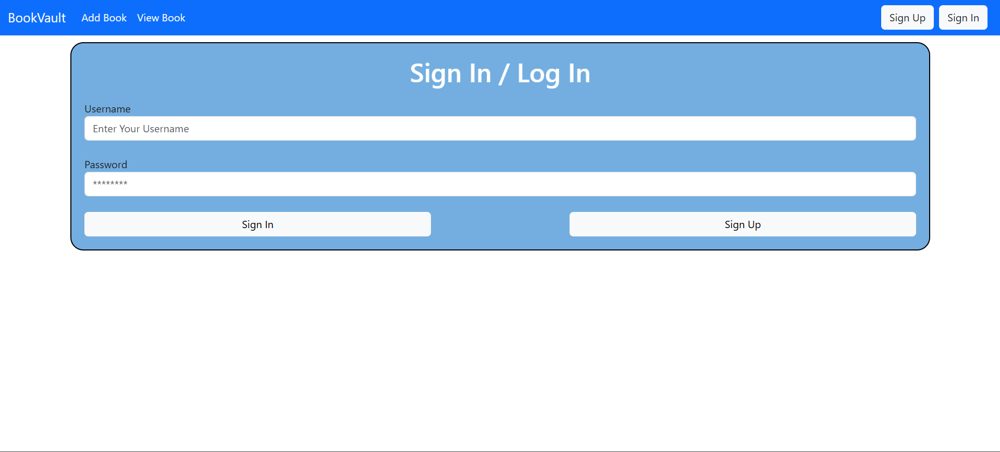
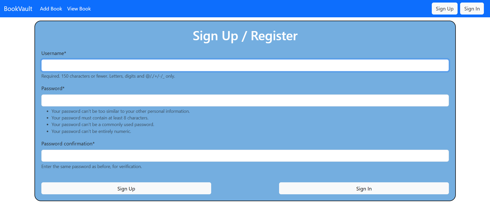
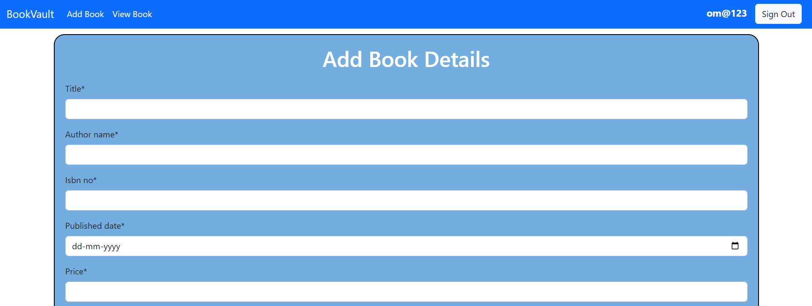
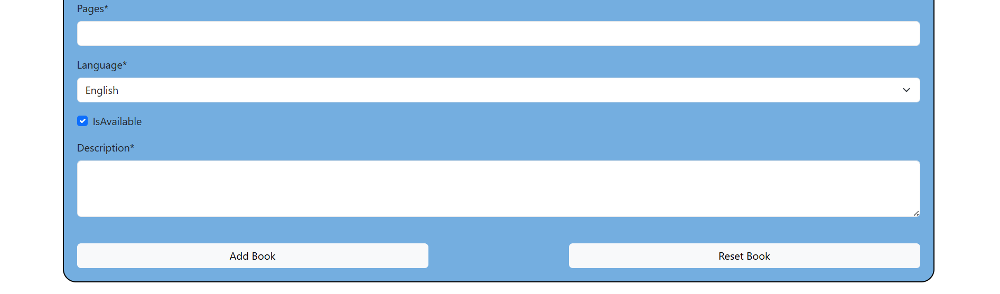
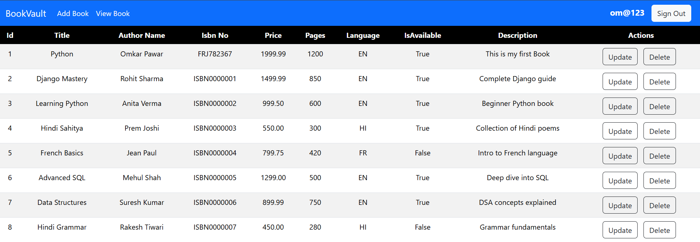
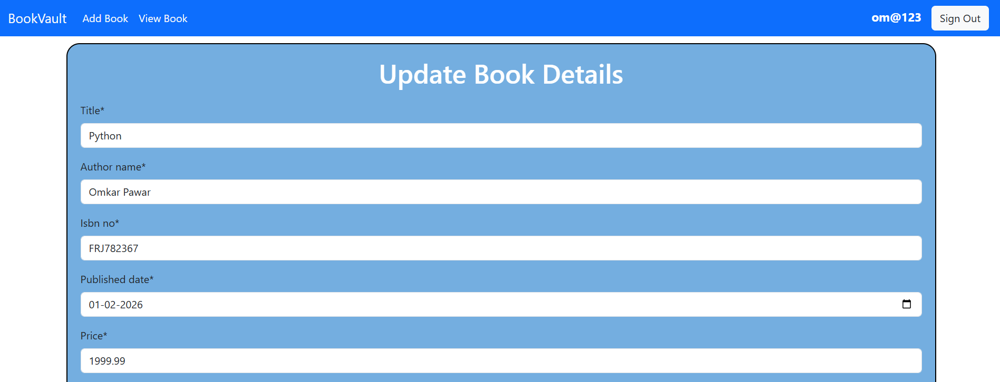
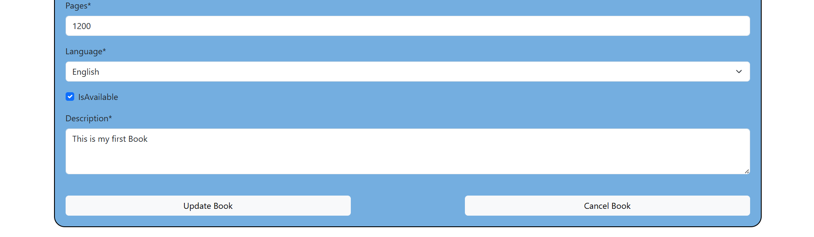
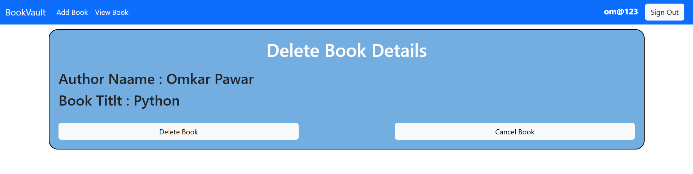

# 📚 Django Book Inventory System


A Django-based Book Inventory Management System implementing user authentication and full CRUD functionality using Function-Based Views and MySQL database.

🔗 **GitHub Repository:**  
https://github.com/omkarpawar2002/django-book-inventory

---

## 🚀 Features

- 🔐 User Authentication (Login / Logout)
- ➕ Add New Books
- 📖 View All Books
- ✏️ Update Book Details
- ❌ Delete Books
- 🔢 Unique ISBN Validation
- 🗄️ MySQL Database Integration
- 🧩 Function-Based Views Implementation

---

## 🛠️ Tech Stack

- **Backend:** Python, Django  
- **Database:** MySQL  
- **Frontend:** HTML, CSS, Bootstrap
- **Authentication:** Django Built-in Auth System  
- **Version Control:** Git & GitHub  

---

## 📂 Project Structure

```
django-book-inventory/
│
├── BookVault/
│   ├── auth_book/
│   ├── manage_book/
│   ├── templates/
│   ├── static/
│   └── manage.py
│
├── .gitignore
├── requirements.txt
└── README.md
```

---

## 📸 Screenshots

### 🔐 Sign In Page


### 📝 Sign Up Page


### ➕ Add Book Page



### 📖 View Books Page


### ✏️ Update Book Page



### ❌ Delete Book Page


---

## ⚙️ Installation & Setup

### 1️⃣ Clone the Repository

```bash
git clone https://github.com/omkarpawar2002/django-book-inventory.git
cd django-book-inventory
```

### 2️⃣ Create Virtual Environment

```bash
python -m virtualenv venv
```

Activate it:

**Windows**
```bash
venv\Scripts\activate
```

**Mac/Linux**
```bash
source venv/bin/activate
```

### 3️⃣ Install Dependencies

```bash
pip install -r requirements.txt
```

### 4️⃣ Configure Database

Update your `settings.py` with your MySQL configuration.

### 5️⃣ Run Migrations

```bash
python manage.py makemigrations
python manage.py migrate
```

### 6️⃣ Run Development Server

```bash
python manage.py runserver
```

Open in browser:

```
http://127.0.0.1:8000/
```

---

## 📊 Database Model Fields

- Title  
- Author Name  
- ISBN (Unique)  
- Published Date  
- Price  
- Pages  
- Language (Choices: EN, HI, FR)  
- Availability (Boolean)  
- Description  
- Created At  
- Updated At  

---

## 🔮 Future Improvements

- 🔍 Search Functionality  
- 📄 Pagination  
- 🖼️ Book Cover Image Upload  
- 👥 Role-Based Access Control  
- 🌐 Deployment (Render / Railway / AWS)  
- 🔗 REST API using Django REST Framework  

---

## 👨‍💻 Author

**Omkar Pawar**  

GitHub:  
https://github.com/omkarpawar2002  

---

## 📜 License

This project is open-source and available under the MIT License.
